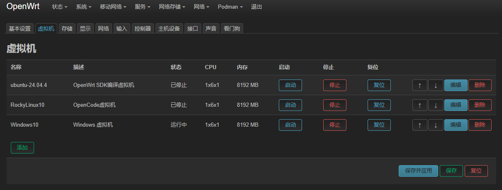
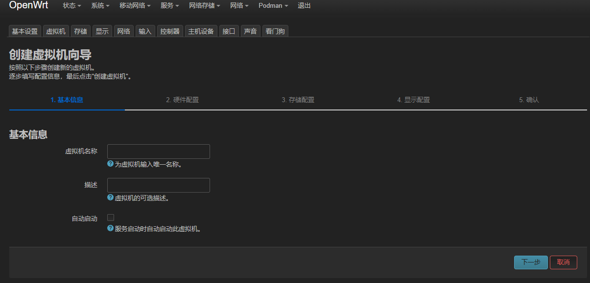
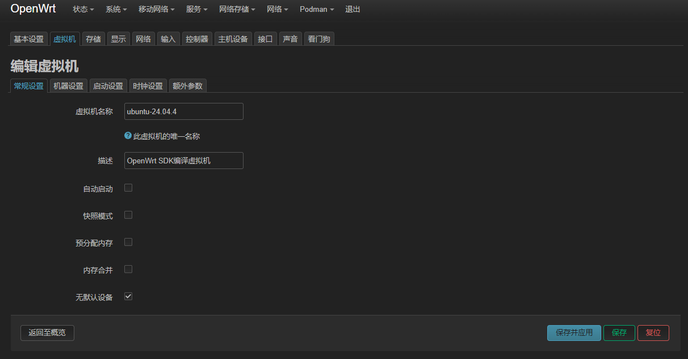
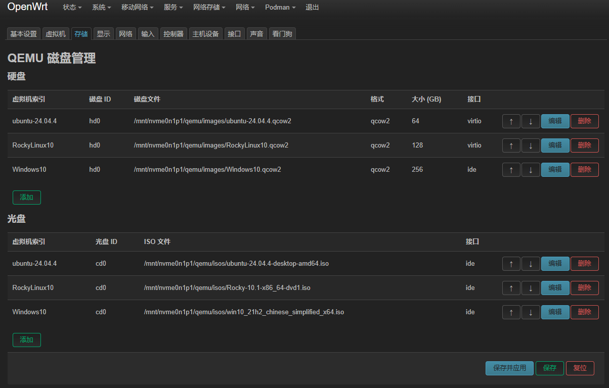
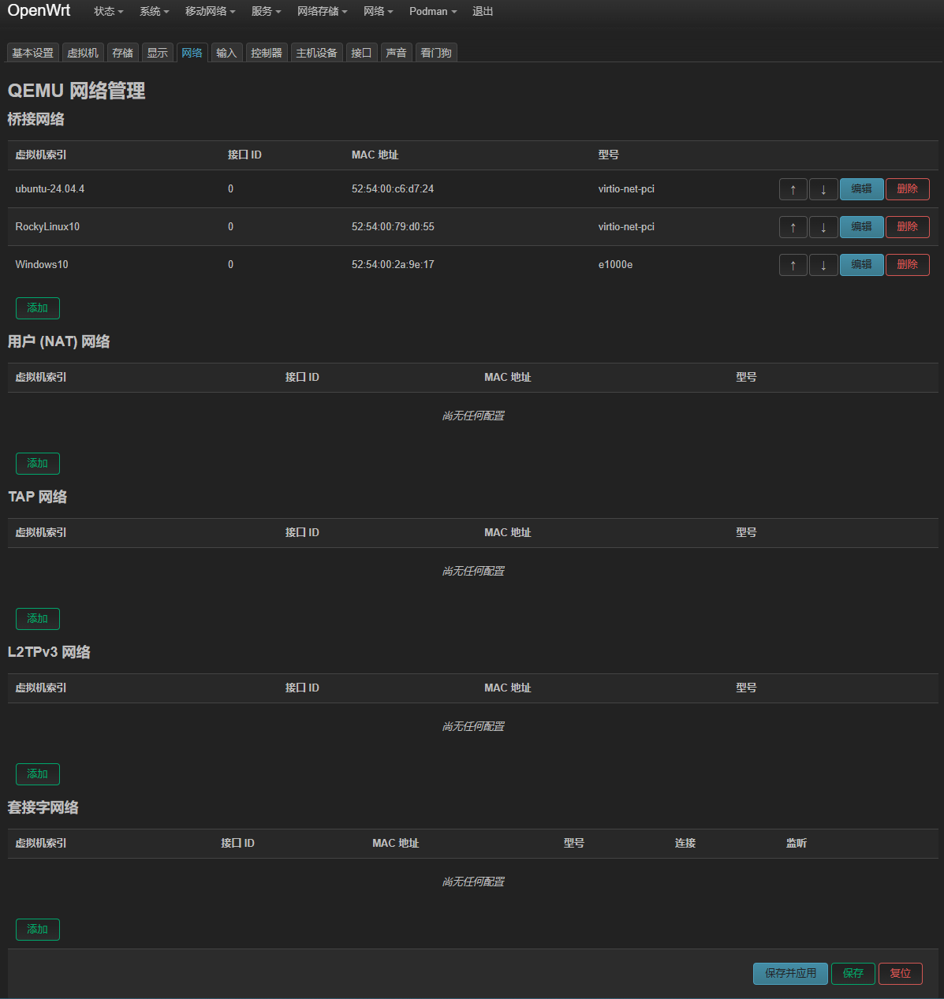
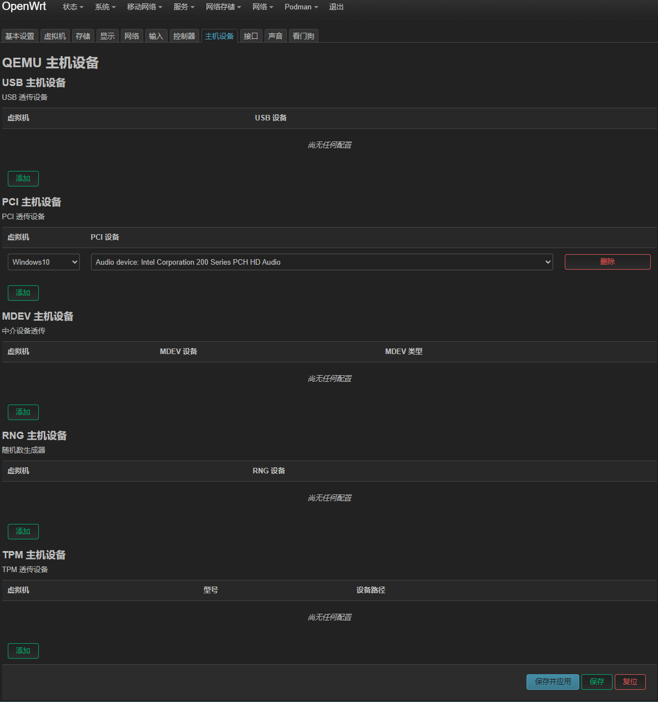
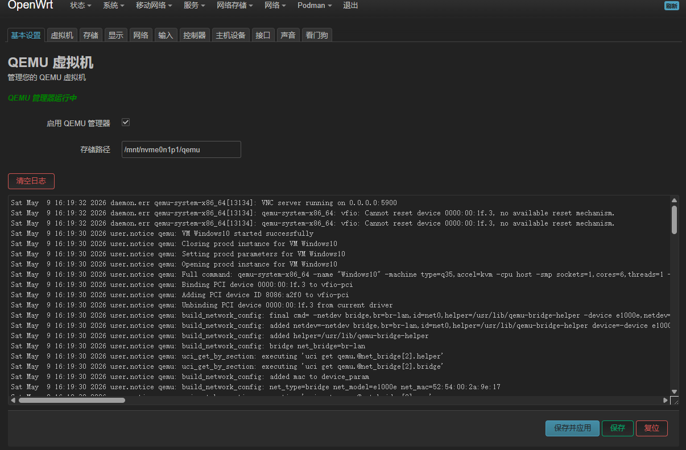

# luci-app-qemu

QEMU Virtual Machine Manager for OpenWrt/LEDE

## Sponsor

If you find this project helpful, you can sponsor me:

<div align="center">

<table>
<tr>
<td></td>
<td></td>
</tr>
<tr>
<td align="center">WeChat</td>
<td align="center">Alipay</td>
</tr>
</table>

</div>

## Overview

luci-app-qemu is a LuCI-based web interface for managing QEMU virtual machines on OpenWrt/LEDE systems. It provides a user-friendly interface to create, configure, start, stop, and monitor virtual machines directly from the web browser.

## Screenshots

### Virtual Machine List


### Add New Virtual Machine


### Basic Settings


### Storage Configuration


### Network Configuration


### PCI Device Passthrough


### Global Settings


## Features

- **Virtual Machine Management**
  - Create new virtual machines with wizard
  - Start, stop, restart virtual machines
  - View VM status and resource usage
  - Force stop unresponsive VMs
  - Auto-start configuration

- **Hardware Configuration**
  - CPU and memory allocation
  - Storage device management (disk images, VirtIO, IDE, SCSI, USB)
  - Network interface configuration
  - Display settings (VNC)
  - Input devices (keyboard, mouse)
  - Sound devices
  - Controller devices (USB, SCSI, VirtIO Serial)
  - Host device passthrough (PCI Passthrough)
  - Watchdog timer

- **Advanced Settings**
  - Boot options (Legacy BIOS/UEFI)
  - VNC display with password protection
  - Serial console access
  - QMP interface for advanced management

- **Storage Management**
  - Create and manage disk images
  - Support for various disk formats (qcow2, raw, etc.)
  - Disk image resizing

- **Network Configuration**
  - User mode NAT network
  - Tap network
  - Bridge network interfaces
  - Socket network
  - Port forwarding

## Requirements

- OpenWrt 25.12.1 or later
- QEMU packages:
  - `qemu-system-x86_64` (or other architectures as needed)
  - `qemu-img`
  - `qemu-bridge-helper`
  - `qemu-firmware-seabios` (for Legacy BIOS support)
- OVMF package (for UEFI support):
  - Build from [edk2-ovmf](https://github.com/hoyoho/edk2-ovmf) for OpenWrt
- Kernel modules:
  - `kmod-tun`
  - `kmod-kvm-amd` or `kmod-kvm-intel` (for hardware acceleration)
- Additional packages:
  - `socat` (for QMP communication)
  - `luci-compat` (for LuCI compatibility)

## Installation

### From APK Package

1. Download the latest APK package from the [releases](https://github.com/hoyoho/luci-app-qemu/releases) page
2. Upload the APK to your OpenWrt device
3. Install the package:
   ```bash
   apk add --force-overwrite --allow-untrusted luci-app-qemu*.apk luci-i18n-qemu*.apk
   ```
4. Install runtime dependencies:
   ```bash
   apk add qemu-system-x86_64 qemu-img qemu-bridge-helper qemu-firmware-seabios kmod-tun kmod-kvm-amd socat
   ```

### From Source

To build luci-app-qemu from source, add the custom feed to your OpenWrt build environment:

1. Clone the repository to your OpenWrt SDK's packages directory:
   ```bash
   git clone https://github.com/hoyoho/luci-app-qemu.git /path/to/sdk/package/luci-app-qemu
   ```

2. Enter the build configuration menu:
   ```bash
   make menuconfig
   ```

3. In `make menuconfig`, navigate to `LuCI → Applications` to select luci-app-qemu.

4. Exit and save, then compile:
   ```bash
   make package/luci-app-qemu/compile
   ```

## Usage

### Accessing the Interface

1. Open your web browser and navigate to your OpenWrt router's web interface
2. Go to **Services → QEMU Virtual Machines**

### Creating a Virtual Machine

1. Click **Add New Virtual Machine** to start the wizard
2. Follow the steps to configure:
   - Basic settings (name, description)
   - Hardware configuration (CPU, memory)
   - Storage devices (disk images)
   - Network interfaces
   - Display settings (VNC)
   - Advanced options
3. Click **Create** to finish

### Managing Virtual Machines

- **Start**: Click the **Start** button to boot the VM
- **Stop**: Click the **Stop** button to gracefully shut down the VM
- **Force Stop**: Click the **Force Stop** button to immediately terminate the VM
- **Restart**: Click the **Restart** button to reboot the VM
- **Edit**: Click the **Edit** button to modify VM settings
- **Delete**: Click the **Delete** button to remove the VM

### VNC Access

1. Ensure VNC is enabled in the VM's display settings
2. Use a VNC client to connect to `your-router-ip:590X` (where X is the VNC port offset)
3. Enter the password if configured

### Storage Management

1. Go to the **Storage** tab
2. Click **Add Disk Image** to create a new disk
3. Select the disk format and size
4. Click **Create** to generate the disk image

## Configuration

### Global Settings

- **Storage Path**: Default location for disk images
- **Enabled**: Global enable/disable switch for QEMU

### Virtual Machine Settings

Each VM has its own configuration including:
- Name and description
- CPU and memory allocation
- Storage devices
- Network interfaces
- Display settings
- Boot options
- Auto-start configuration

## Troubleshooting

### Common Issues

1. **VM fails to start**
   - Check if QEMU packages are installed
   - Verify disk images exist and are accessible
   - Check for port conflicts (especially VNC ports)

2. **VNC connection refused**
   - Ensure VNC is enabled in VM settings
   - Check if the VM is running
   - Verify firewall settings allow VNC traffic

3. **Performance issues**
   - Enable KVM hardware acceleration if available
   - Adjust CPU and memory allocation
   - Use SSD storage for better performance

### Logs

- Check system logs for QEMU-related messages:
  ```bash
  logread | grep qemu
  ```
- Check VM-specific logs in the web interface

## Contributing

Contributions are welcome! Please feel free to submit a Pull Request.

### Development Guidelines

- Follow the existing code style
- Test changes thoroughly
- Provide clear commit messages
- Update documentation as needed

## License

This project is licensed under the MIT License - see the [LICENSE](LICENSE) file for details.